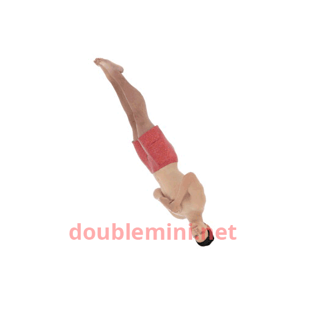
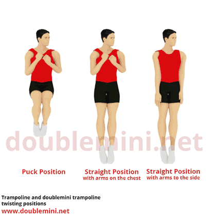

# Twisting

Twisting is an important skill in trampoline gymnastics, but learning how to twist is not always easy for gymnasts. Momentum, twisting directions, correct arm movement and body mechanics increase the complexity of every twisting skill. It is very important that a gymnast learns the correct techniques from the beginning as bad habits form quickly and hinder progression into advanced skills.

Here we will explore the techniques and physics of twisting on a trampoline.

## The Physics of Twisting

Twisting is the process of rotation along the vertical axis of the body.

There are three ways of initiating a twisting rotation in a jump:

### Tilt twist

In a tilt twist, the twisting rotation is achieved by reaching away from your body with one arm. This **imbalance transfers rotational energy** from the somersault rotation into the twist, causing the body to spin. Tilt twisting is only possible with a somersault rotation along the horizontal body axis. If you extend your arm in a straight jump you will not achieve any rotation.

### Contact twist

Contact twisting is the act of **physically pushing off** into the twist from the ground. The twist is initiated from the feet. A straight jump with a twist uses this technique as there is no somersault rotation from wich the twisting rotation can be taken with a tilt. 

### Cat twist
To do a cat twist a gymnast moves his/her body around the center of gravity. This only works when **changing from a shape** like tuck or pike into the straight position or the other way around. This form of twisting mostly results in only a half twist. It is used in skills like the swivel hips or baranis in tuck or pike position. The same physics a cat uses to always land on its feet are happening here.

Confused? check out David Morris' video on twisting where he explains these three types of rotation.

<iframe width="560" height="315" src="https://www.youtube-nocookie.com/embed/v4ar1ZmzLps?si=u4hgUZzo_w1cDi_Y" title="YouTube video player" frameborder="0" allow="accelerometer; autoplay; clipboard-write; encrypted-media; gyroscope; picture-in-picture; web-share" allowfullscreen></iframe>

A back full (backflip with one twist) use tilt twisting to initiate rotation along the vertical axis.

Every twist uses one or a combination of these twisting initiators.  

Ideally, you would only use tilt twisting in trampoline gymnastics, but many gymnasts initiate the twist by pushing off from the trampoline bed with their feet, thereby performing a contact twist, before using their arms to initiate a tilt twist.  

## Arm and body position

Twists are mostly performed in a **straight position** with the arms down to the side. gymnasts often hold their **arms on their chest** during elements with many twists as it can increase the speed of the twist.  

Twists can also be done in the so-called **'puck'** position, a **modified tuck** position which makes the somersault rotation easier but results in a slower twisting rotation. The puck position counts as a tuck position in the difficulty score.

## Stopping the twist

In order to stop the twisting rotation the gymnast can **spread their arms apart**. For baranis, single somersaults with a half twist and half outs the arms should not be opened more than 45° (angle between the torso and the arms) otherwise a 0.1 deduction will be made.

In Somersaults with more twists they can lift the arms up to 90° (horizontal) without a deduction.

To learn more about the execution score and deductions click here
___
The twist in every jump should be **completed before** the gymnast completes 3/4 of the last somersault rotation. Otherwise a deduction of 0.1 will be made.

To learn more about the execution score and deductions click here.
